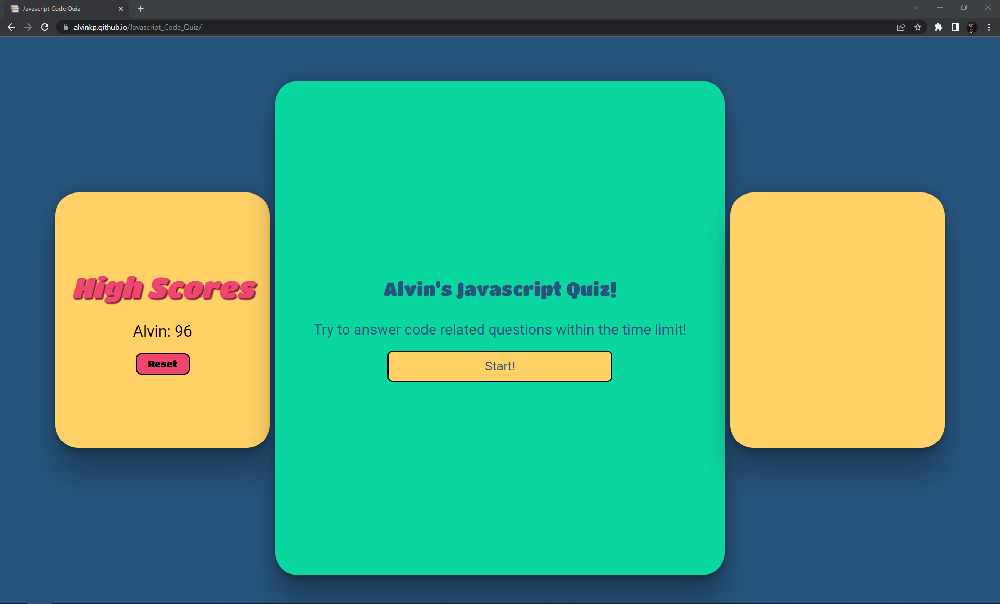
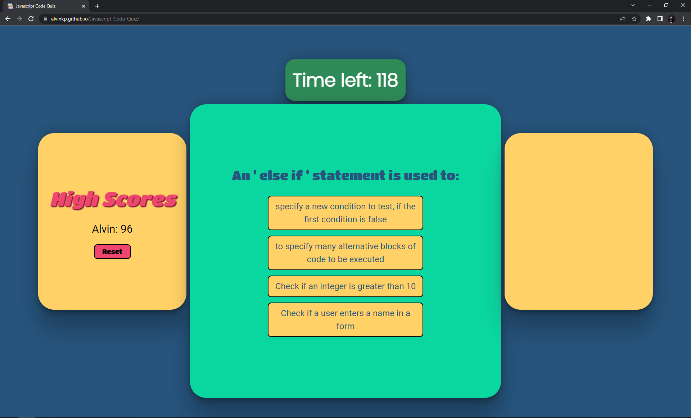
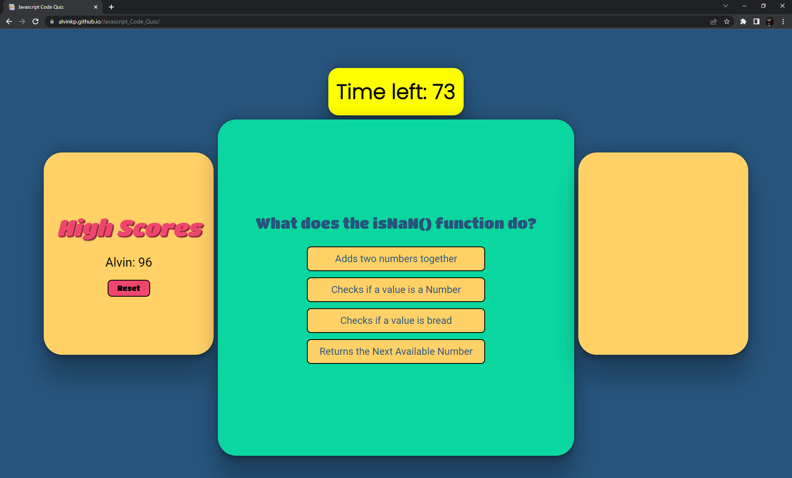
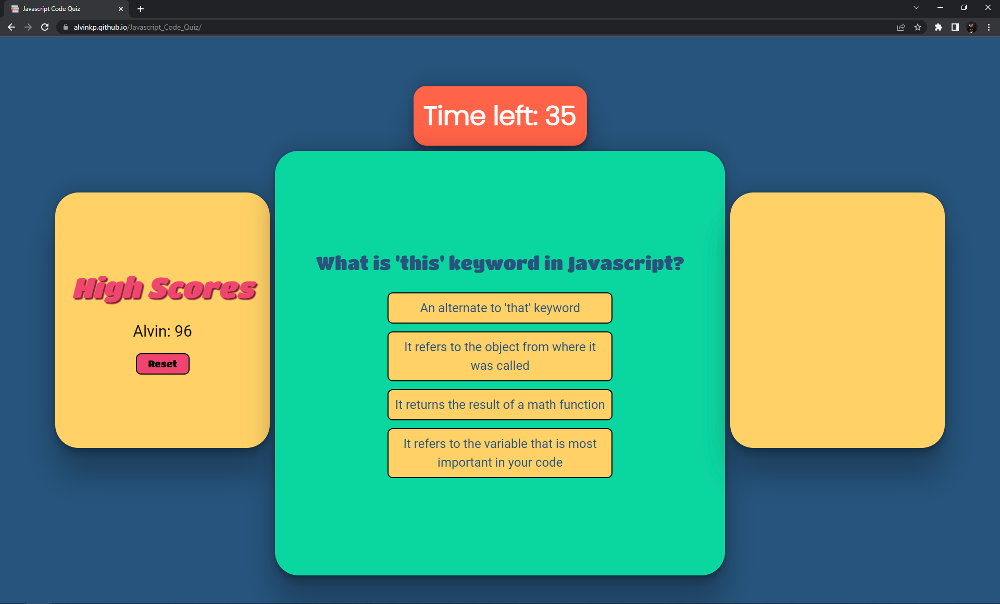
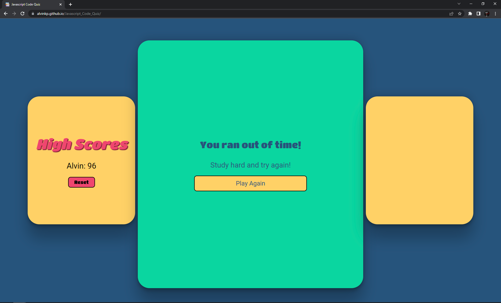
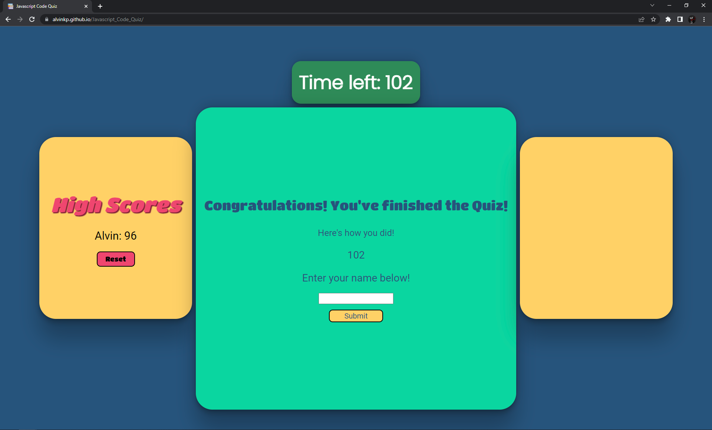
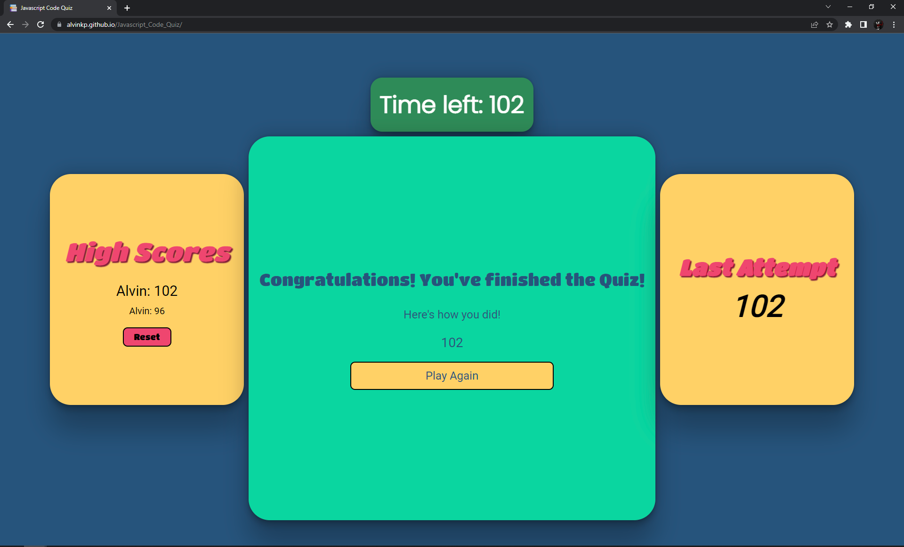

# Javascript_Code_Quiz

This was the fourth challenge assignment for our UPENN Bootcamp. We were tasked with creating a Javascript Quiz. (See **User Story** and **Acceptable Criteria** sections below).

---

## 📕 User Story 

AS A coding boot camp student
I WANT to take a timed quiz on JavaScript fundamentals that stores high scores SO THAT I can gauge my progress compared to my peers

---

## ✔️ Acceptable Criteria 

- GIVEN I am taking a code quiz
- WHEN I click the start button THEN a timer starts and I am presented with a question
- WHEN I answer a question THEN I am presented with another question
- WHEN I answer a question incorrectly THEN time is subtracted from the clock
- WHEN all questions are answered or the timer reaches 0 THEN the game is over
- WHEN the game is over THEN I can save my initials and score

---

## 🔧 Optimizations 

### HTML
- Created placeholder HTML containers for content created through Javascript
- Added Google Fonts and Favicon

### CSS
- Styled Website
- Added animations for the correct and wrong answers

### Javascript
- Generated and removed HTML Elements as needed
- Controlled animations in CSS from Javascript
- Handled game loop and local storage through Javascript 

---

## 📷 Screenshots 

---

## 🎯 Deployment

Website: https://alvinkp.github.io/Javascript_Code_Quiz/

Repository: https://github.com/alvinkp/Javascript_Code_Quiz

---

## ✉️ Authors 

- [@alvinkp](https://www.github.com/alvinkp)

